## SQL查询语言

* ***SQL语言:***
  * 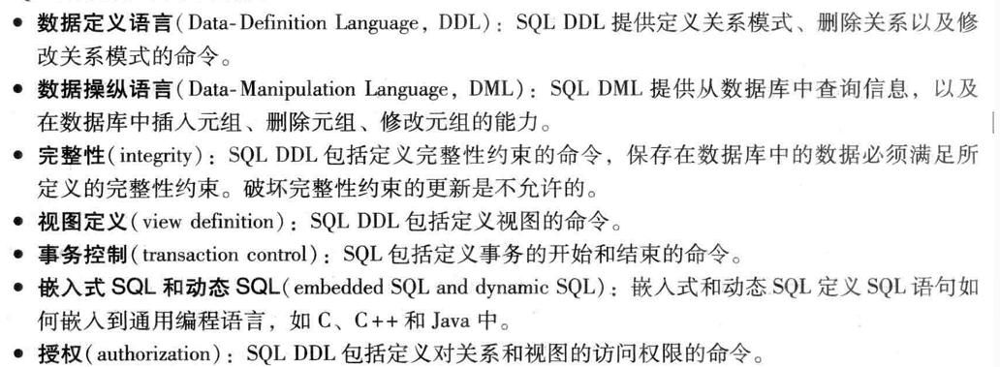

## SQL数据定义

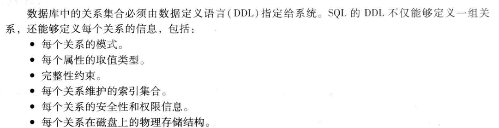

### 基本类型

* ***char(n)***：固定长度的字符串，用户指定长度n。全称***character***。
* ***varchar(n)***:可变长度的字符串，用户指定最大长度为n，全称***character varying***。
* ***int***：整数类型。全称***integer***。
* ***smallint***：小整数类型（和机器线管的证书类型的子集）。
* ***numeric(p,d)***：定点数，精度由用户指定。这个数由p位数字（加上一个符号位），其中d位数字在小数点右边。
* ***real,double precision***:浮点数与双精度浮点数，精度与机器相关。
* ***float(n)***：精度至少为n的浮点数。

### 基本模式定义

* ***CREATE TABLE：***

```
			create table department(
				dept_name varchar(20),
				building varchar(15),
				budget numeric(12,2),
				primary key (dept_name)
			);
```

create table 命令还指明了的dept——name属性是department关系的主码。


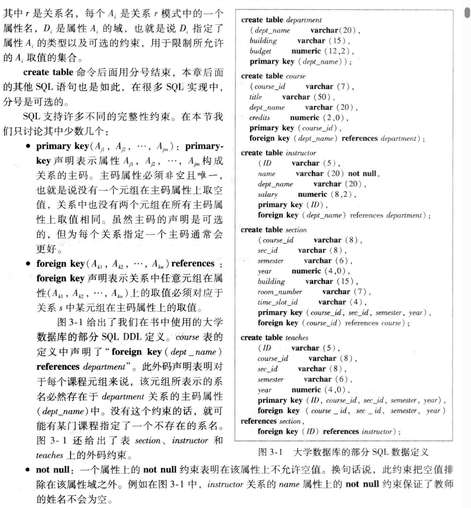

### [SQL语法教程]([SQL 语法 | 菜鸟教程 (runoob.com)](https://www.runoob.com/sql/sql-syntax.html))

### 自然连接

* ***自然连接：***作用于两个关系，并产生一个关系作为结果。不同于笛卡尔积，它将第一个关系的每个元组和第二个关系的所有元组都进行连接，自然连接只考虑那些在两个关系模式中都出现的属性上取值相同的元组对。

```
						select name,course_id
						from instructor,teaches
						where instructor.ID = teaches.ID;
                        //自然连接
                        select name,course_id
                        from instructor nature join teacges;
```

* 注意事项：

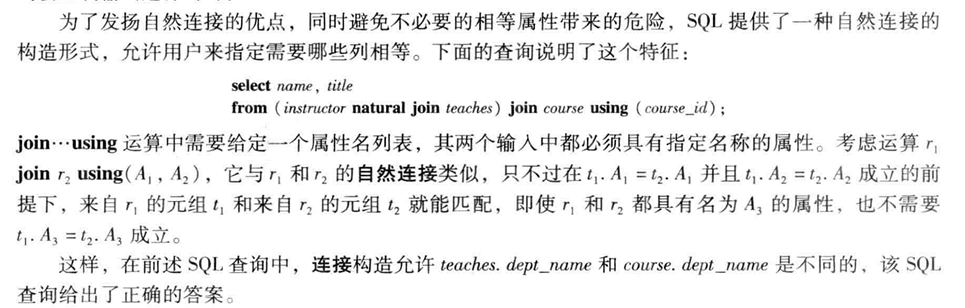
## 附加的基本运算

### 更名运算

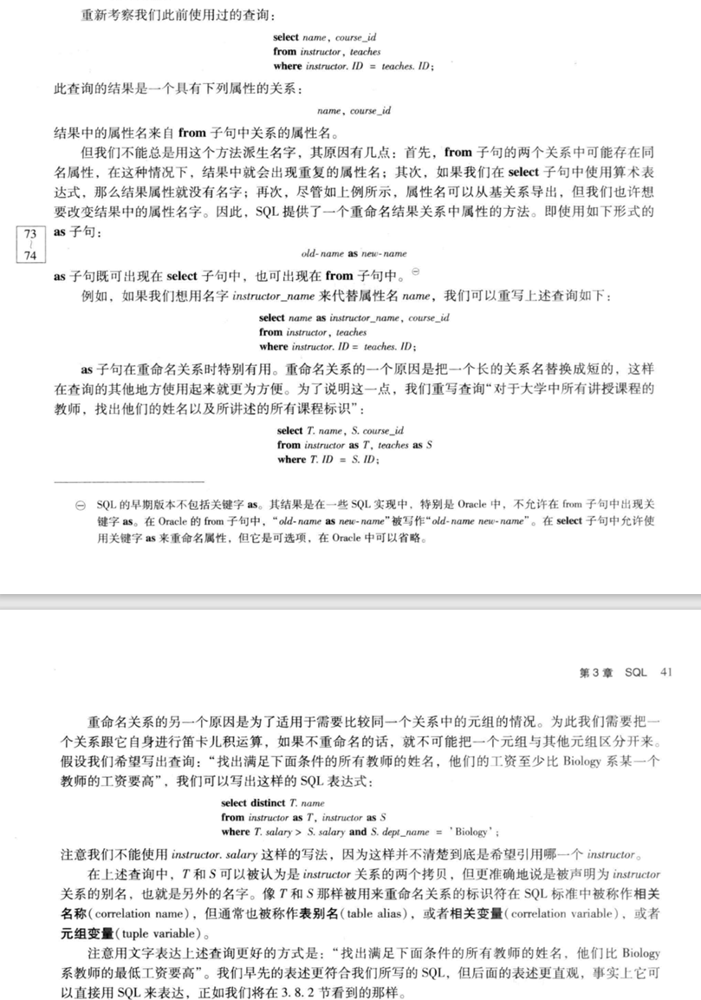

### 字符串运算

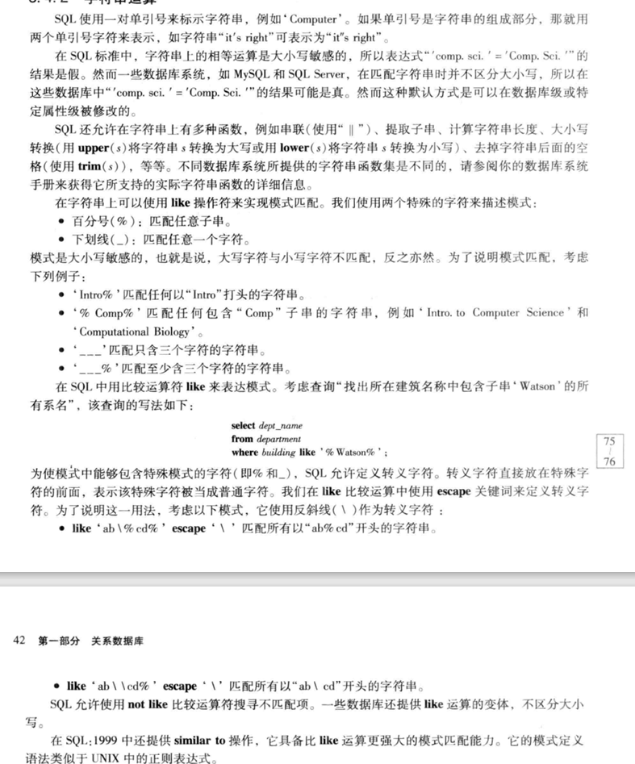

### select子句中的属性说明

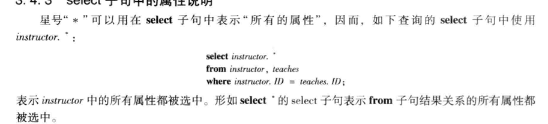

### 排列元组的显示次序

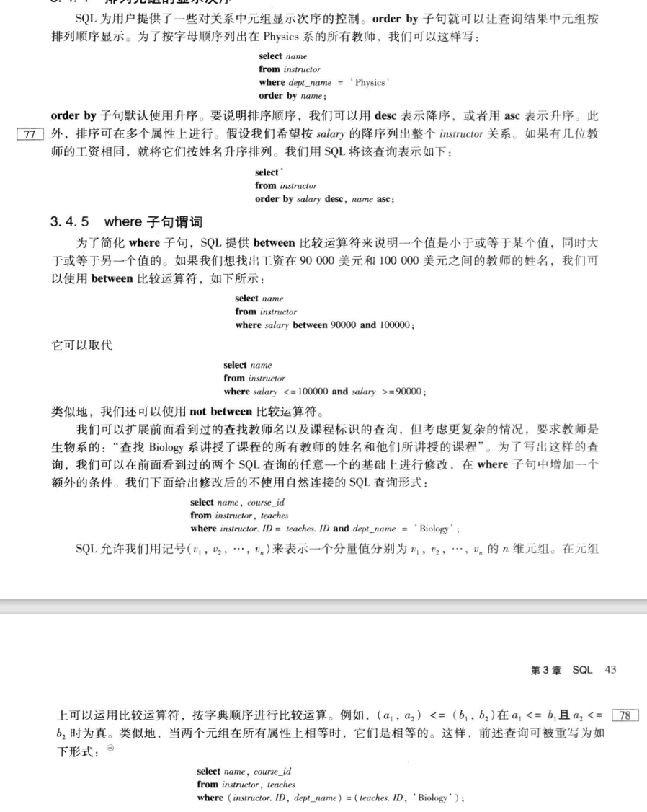

### where子句谓词

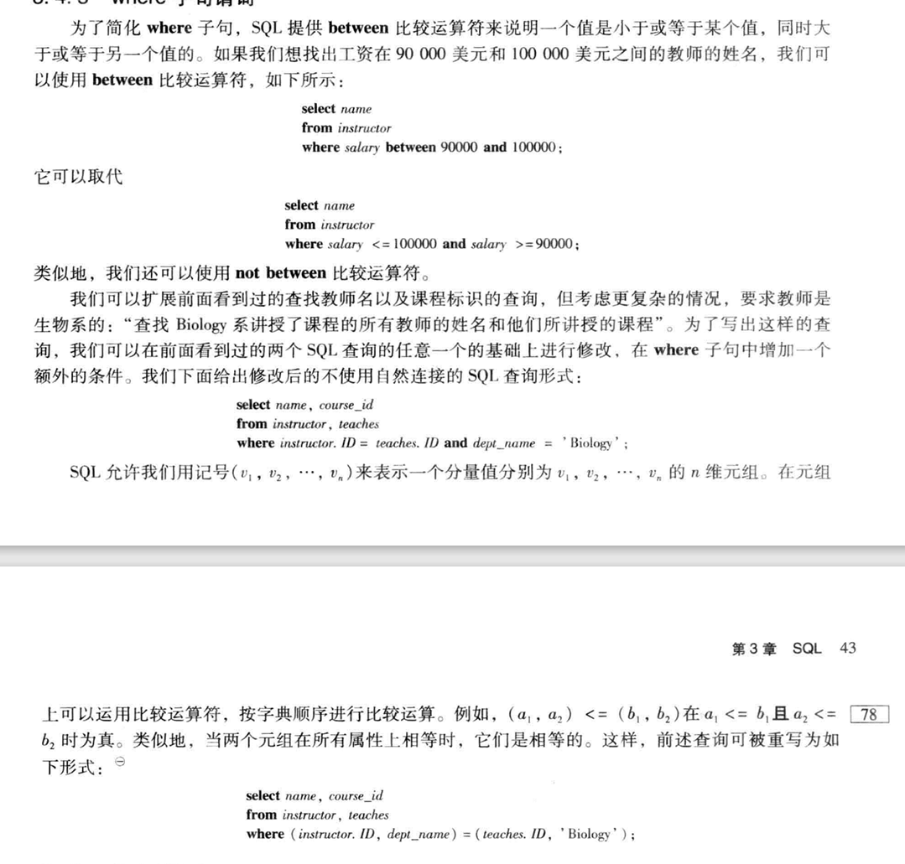

## 集合运算

### 并运算

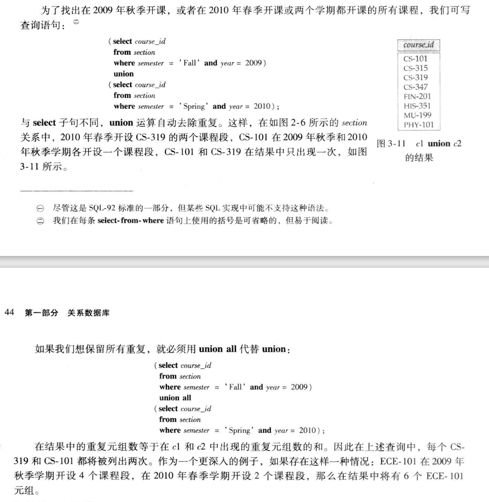

### 交运算

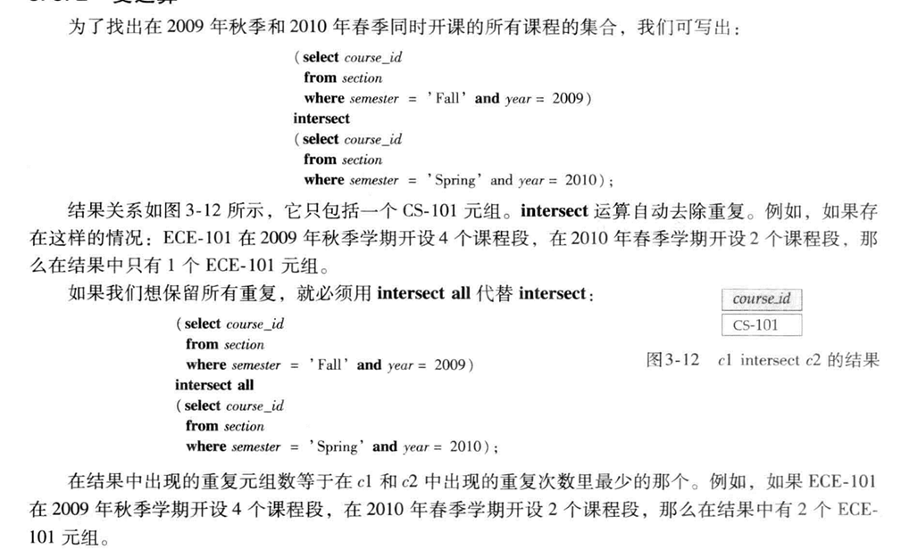

### 差运算

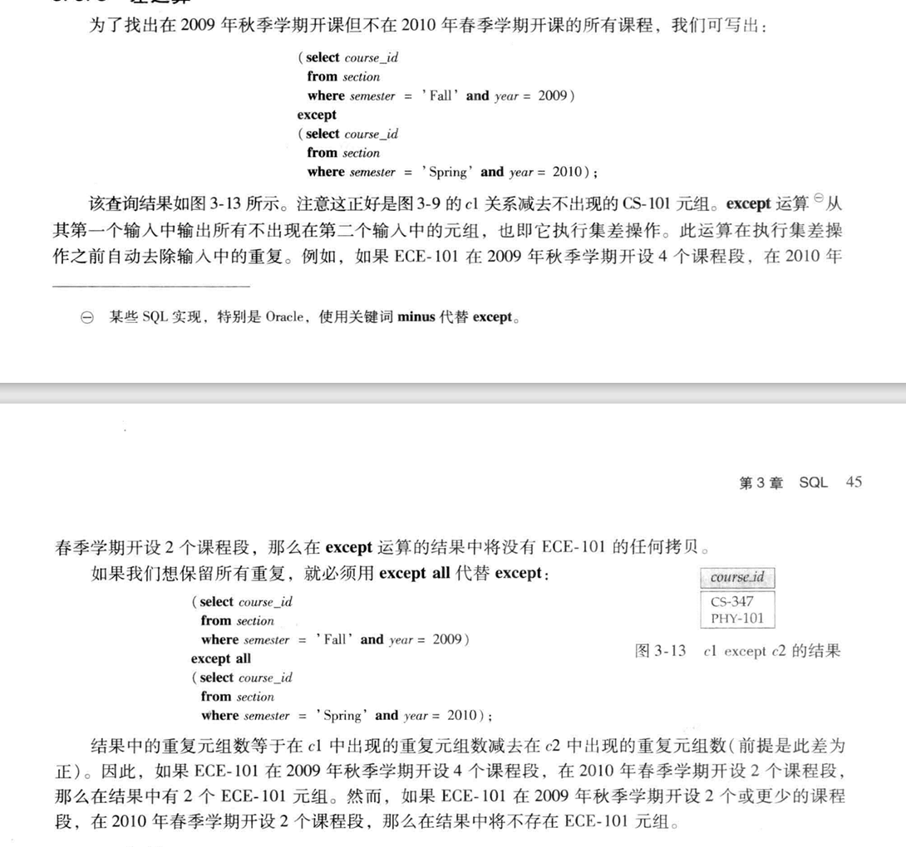

## 空值

