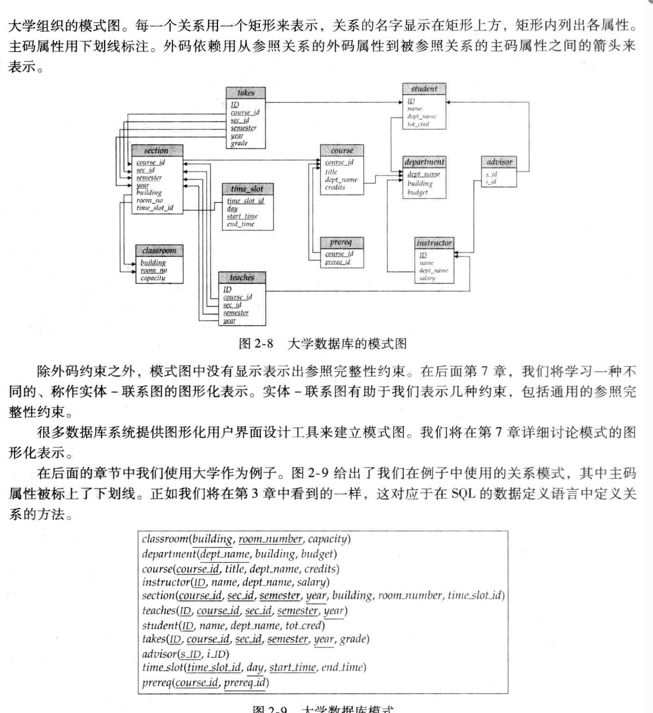
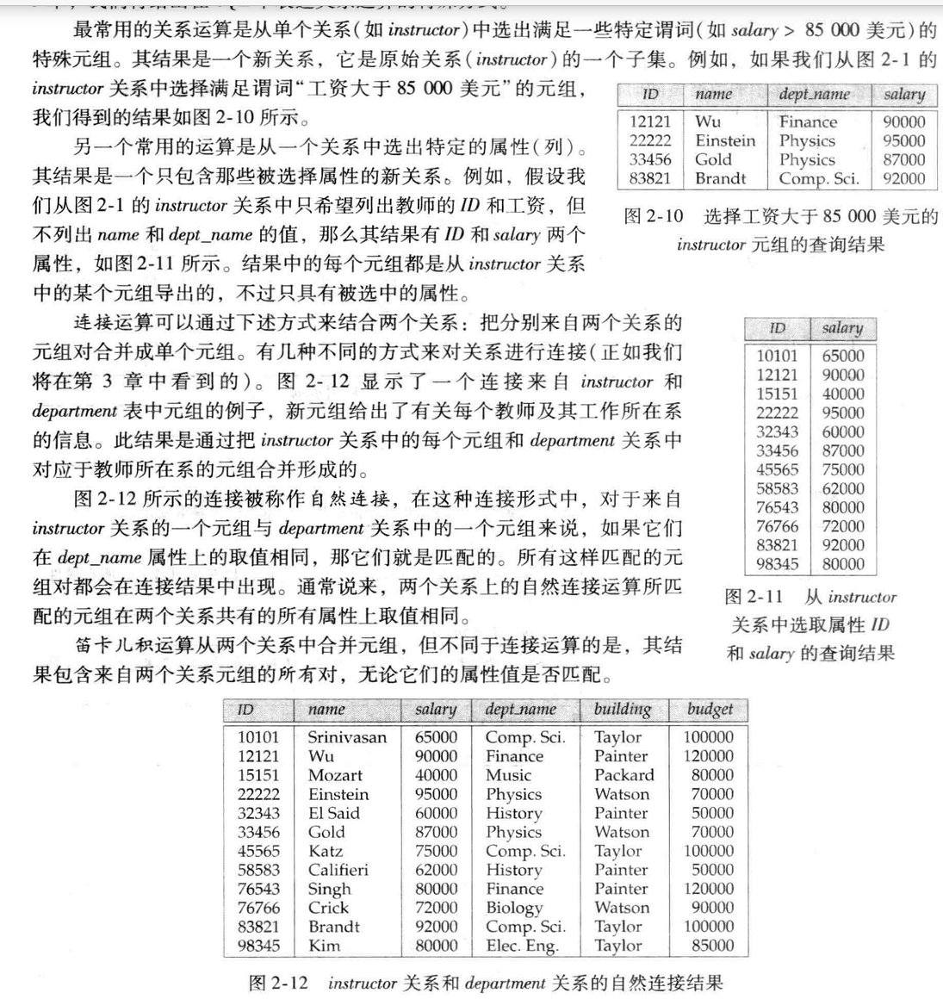
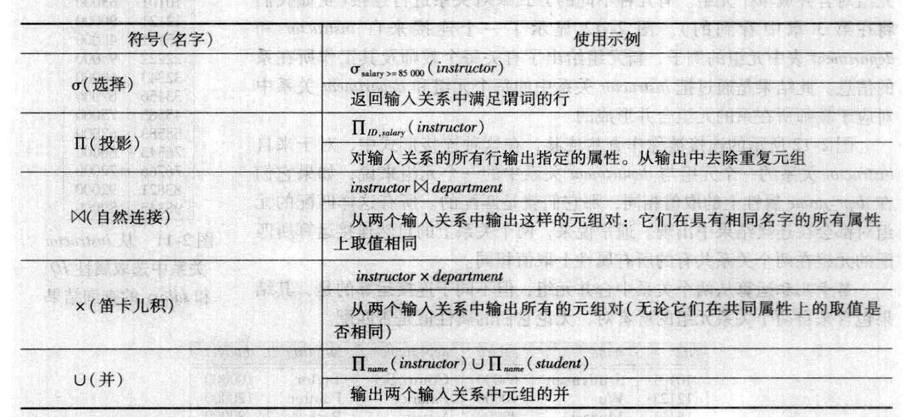

# 关系模型介绍

## 关系数据库的结构

 * 关系数据库由***表***的集合构成，每个表有唯一的名字。
 * 表中一行代表了一组之间的一种联系。
 * 表就是这种联系的一个集合。表这个概念和数学上的关系这个概念是密切相关的。
 * ***元组***只是一组值的序列。在n个值之间的一种联系可以在数学上用关于这写值的一个n元组来表示，<==>n元组就是一个有n个值的元组。
 * 在关系模型的术语中，***关系***用来指代表，***元组***用来指代行。***属性***指代表中的列。
 * 用***关系实例***来表示一个关系的特定实例，也就是所包含的一组特定的行。
 * 对于关系的每个属性，都存在一个允许取值的集合，称为该属性的***域***。
 * 对所有关系R而言，R的所有属性的域都是原子的，如果域中元素看作是不可再分的单元，则域是***原子的***。
 * ***空***值是一个特殊的值，表示值未知或不存在。

## 数据库模式

* ***数据库模式：***数据库的逻辑设计。
* ***数据库实例：***给定时刻数据库中数据的一个快照。
* ***关系概念：***对应程序设计语言类型定义的概念。

## 码

* ***超码：***一个或多个属性的集合，这些属性的组合可以使我们在一个关系中唯一地标识一个元组。

特点：

1. 可能包含无关属性
2. 超码的任意超集也是超码。（通俗讲，就是同一个关系r上，如果某个属性集合S包含超码K，即K是S的子集，那么S也是 r 的超码）
3. 一张表（一个关系）一定有超码，因为至少所有属性的组合一定是超码，能唯一确定一个元组
4. 不唯一

形式化描述：设R表示关系r模式中的属性集合。如果说R的一个子集K是r的一个***超码***，则限制了关系r中任意两个不同元组不会在K的所有属性上取值完全相等，即t1和t2在r1的且t1≠t2，则t1.K≠t2.K。

* ***候选码：***一个或多个属性的集合，这些属性的组合可以使我们在一个关系中唯一地标识一个元组。

特点：

1. 是超码的一个子集
2. 任意真子集都不可能是超码，候选码就是最小的超码
3. 没有无关属性
4. 不唯一

* ***主码：***一个或多个属性的集合，这些属性的组合可以使我们在一个关系中唯一地标识一个元组。

特点：

1. 是候选码之一
2. 唯一或没有
3. 由数据库设计者指定，不指定的话表就没有主码

* ***外码：***

***什么时候有外码？***关系 r1 的属性中包含关系 r2的主码 ，设这个属性为 k

***哪个是外码？***k 就是 r1 的外码

***r1 、 r2 与外码的关系？***r1 是 k 依赖的参照关系（referencing relation) r2 是 k 的被参照关系（referenced relation)
***参照完整性约束：***在参照关系中，任意元组在特定关系上的取值必然等于被参照关系中某个元素在特性关系上的取值

解释:
r1 在 k 属性上的取值是r2 在 k 属性（属性名称可能不一样）上取值的子集。
如果把 r1 中某个元组的 k 属性的取值看做一个变量x，r2中k属性的取值的集合设为s,
那么s 就是变量 x 的值域。

## 模式图

* 一个含有主码和外码依赖的数据库模式可以用***模式图***来表示。

​	

	## 关系查询语言

* ***查询语言：***是用户从数据库中请求获取信息的语言。
  * ***过程化语言：***用户指导系统对数据库执行一系列操作以计算出所需结果。
  * ***非过程化语言：***用户只需描述所需信息，而不用给出获取该信息的具体过程。

## 关系运算

* ***关系代数***

  

  

  