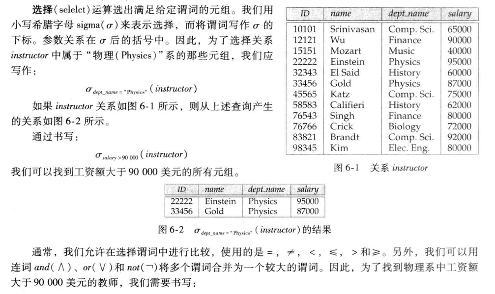
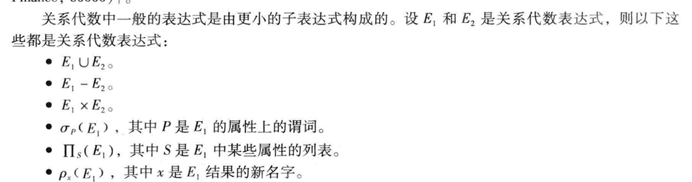

## 关系代数

* 关系代数是一种过程化查询运算，包括一个运算的集合，这些运算以一个或两个关系为数额u，产生一个新的关系作为结果。
* 关系代数基本运算有： ***选择***，***投影***，***并***，***集合差***，***笛卡尔积***，***更名***。

### 基本运算

* ***一元***运算：选择，投影，更名。
* ***二元***运算：并，集合差，笛卡尔积。

#### 选择运算



#### 投影运算


#### 关系运算的组合


#### 并运算

要使r∪s有意义：

* 关系r和s必须是同元的，即它们的属性数目必须相同。
* 对所有的i，r的第i个属性的域必须和s的第i个属性的域相同

#### 集合差运算

* 必须保证集合差运算在相容的关系间进行。

#### 笛卡尔积

#### 更名运算

对给定的关系代数表达式E，表达式

​				***ρ~x~(E)***

返回表达式E的结果，并把名字x赋给它。


### 关系代数的形式化定义



### 附加的关系代数运算

#### 集合交运算

*** r∩s = r-(r-s)***

#### 自然连接运算

自然连接运算（Natural Join）是关系代数中的一种二元运算，用于将两个关系基于它们的同名属性进行连接。在进行自然连接时，系统会自动识别两个关系中的同名属性，并基于这些属性的相等值来组合元组。

***操作步骤***

1. **识别同名属性**：首先，确定两个关系中所有同名的属性列。
2. **生成连接条件**：对于每一个同名属性，生成一个连接条件，即要求这两个属性在连接后的关系中相等。
3. **执行连接**：基于这些连接条件，从两个关系的笛卡尔积中选择满足条件的元组组合。
4. **形成结果关系**：将满足条件的元组组合起来，形成一个新的关系。结果关系的属性列包括两个关系中所有不重复的列。

***示例***

假设有两个关系R和S：

关系R:

|  A   |  B   |  C   |
| :--: | :--: | :--: |
|  1   |  x   |  5   |
|  2   |  y   |  6   |
|  3   |  z   |  7   |

关系S:

|  B   |  D   |  E   |
| :--: | :--: | :--: |
|  x   |  10  |  a   |
|  y   |  20  |  b   |
|  w   |  30  |  c   |

执行R和S的自然连接运算：

1. 识别同名属性：R和S中都有属性B。
2. 生成连接条件：B_R = B_S（其中B_R表示关系R中的B属性，B_S表示关系S中的B属性）。
3. 执行连接：从R和S的笛卡尔积中选择满足B_R = B_S条件的元组组合。
4. 形成结果关系：

|  A   |  B   |  C   |  D   |  E   |
| :--: | :--: | :--: | :--: | :--: |
|  1   |  x   |  5   |  10  |  a   |
|  2   |  y   |  6   |  20  |  b   |

注意，由于关系S中没有B值为'z'或'w'的元组，因此这些元组不会出现在自然连接的结果中。同样，关系R中没有B值为'w'的元组，所以关系S中B值为'w'的元组也不会出现在结果中。

自然连接运算在关系型数据库中非常常见，它允许用户基于共同属性将多个表（即关系）组合起来，从而获取更全面的信息。在实际应用中，自然连接通常用于实现数据库中的联接查询（JOIN操作）。

#### 赋值运算

赋值运算在关系代数中并不是一个标准的运算，因为它更多地与程序设计和变量操作相关，而不是与关系或元组的操作相关。然而，在数据库查询处理和编程语言（如SQL）中，赋值是一个常见的概念，用于将查询结果存储到变量或新的关系中。

### 操作描述

赋值运算通常涉及以下步骤：

1. **执行查询**：首先，执行一个或多个关系代数运算或SQL查询，以生成一个结果集。
2. **创建变量或关系**：然后，定义一个变量或一个新的关系来存储这个结果集。
3. **存储结果**：最后，将查询结果赋值给这个变量或存储到新的关系中。

***示例（在SQL中）***

在SQL中，赋值运算通常是通过`SELECT ... INTO`语句来实现的。以下是一个简单的示例：

```sql
SELECT A, B  
INTO NewRelation  
FROM OldRelation  
WHERE C > 5;
```

在这个例子中：

- `SELECT A, B` 是查询部分，它指定了要从`OldRelation`中选择哪些列。
- `INTO NewRelation` 是赋值部分，它指示将查询结果存储到一个名为`NewRelation`的新关系中。
- `FROM OldRelation` 说明了查询的来源。
- `WHERE C > 5` 是一个过滤条件，用于限制查询结果只包含那些`C`列值大于5的行。

执行这个SQL语句后，将创建一个新的关系`NewRelation`，其中包含`OldRelation`中满足条件`C > 5`的行的`A`和`B`列的值。

***注意事项***

- 在一些数据库系统中，`SELECT ... INTO`语句可能会替换现有的同名关系，或者如果关系不存在则创建它。行为可能因数据库管理系统的不同而有所差异。
- 赋值运算通常用于中间步骤或预处理阶段，以便在后续的查询或操作中重用这些数据。
- 在某些情况下，赋值可能不是必要的，因为可以直接在后续的查询中引用子查询的结果。然而，将中间结果存储到变量或关系中可以提高查询性能，特别是当这些结果会被多次使用时。

虽然赋值运算不是关系代数的一部分，但在实际的数据库应用中，它是一个非常有用的工具，可以帮助组织和管理查询结果。

#### 外连接运算

外连接（Outer Join）是关系代数中的一种扩展连接运算，用于处理由于标准连接运算而可能丢失的信息。外连接允许我们获取一个关系中的所有记录，即使它们在另一个关系中没有匹配的记录。外连接运算有以下三种主要类型：左外连接（Left Outer Join）、右外连接（Right Outer Join）和全外连接（Full Outer Join）。

***左外连接（Left Outer Join）***

左外连接会取出左侧关系中所有与右侧关系中任一元组都不匹配的元组，用空值（NULL）填充所有来自右侧关系的属性，构成新的元组，然后将其加入自然连接的结果中。这样，左侧关系中的所有记录都会出现在结果中，而右侧关系中没有匹配的记录则显示为NULL。

***右外连接（Right Outer Join）***

与左外连接相反，右外连接会取出右侧关系中所有与左侧关系中任一元组都不匹配的元组，用空值填充所有来自左侧关系的属性，构成新的元组，然后将其加入自然连接的结果中。这样，右侧关系中的所有记录都会出现在结果中，而左侧关系中没有匹配的记录则显示为NULL。

***全外连接（Full Outer Join）***

全外连接则是左外连接和右外连接的组合。它同时填充左侧关系中所有与右侧关系中任一元组都不匹配的元组，并填充右侧关系中所有与左侧关系中任一元组都不匹配的元组，将产生的新元组加入自然连接的结果中。这样，无论是左侧关系还是右侧关系中的记录，即使它们在对方关系中没有匹配项，也都会出现在结果中，没有匹配的部分用NULL填充。

外连接运算在数据库查询中非常有用，特别是当我们想要保留一个关系中的所有记录，并查看它们与另一个关系的匹配情况时。通过使用外连接，我们可以避免由于缺失匹配项而导致的信息丢失，从而获得更完整的数据视图

### 扩展的关系代数运算

#### 广义投影

广义投影是对传统投影运算的扩展。传统的投影运算通常是从关系中选择出若干属性列，而广义投影不仅允许选择属性列，还允许在投影列表中使用算术运算和字符串函数等来对投影进行扩展。这意味着，广义投影可以基于关系中的属性进行计算，并将这些计算的结果作为投影的一部分。

这种扩展的投影能力使得广义投影在数据库查询和数据处理中更为灵活和强大。通过使用广义投影，用户可以执行更复杂的计算，并将结果直接包含在查询结果中，从而简化了数据处理的过程。

需要注意的是，广义投影的具体实现和语法可能因不同的数据库管理系统而有所差异。因此，在实际使用中，建议查阅特定数据库管理系统的文档以了解广义投影的具体用法和限制。

#### 聚集

## 元组关系演算

### 查询示例

### 形式化定义

### 语言的表达能力

## 域关系演算

### 形式化定义

### 查询的例子

### 表达式的安全性

### 语言的表达能力


