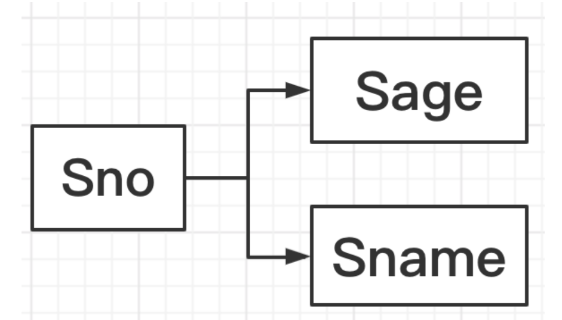
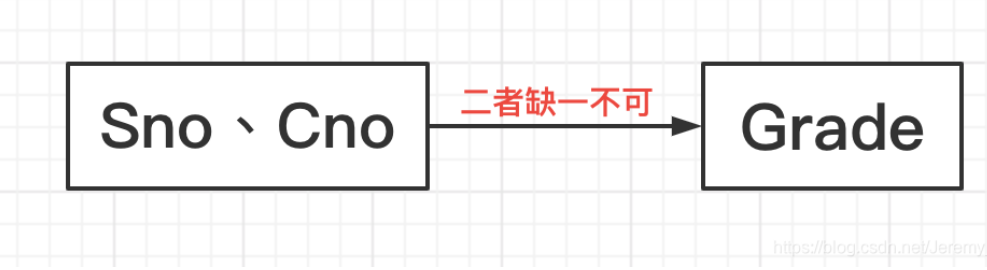
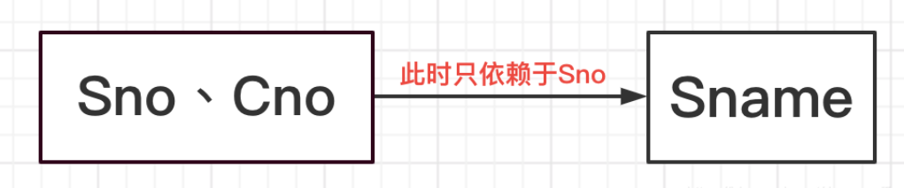
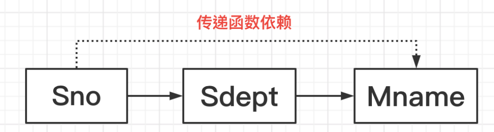
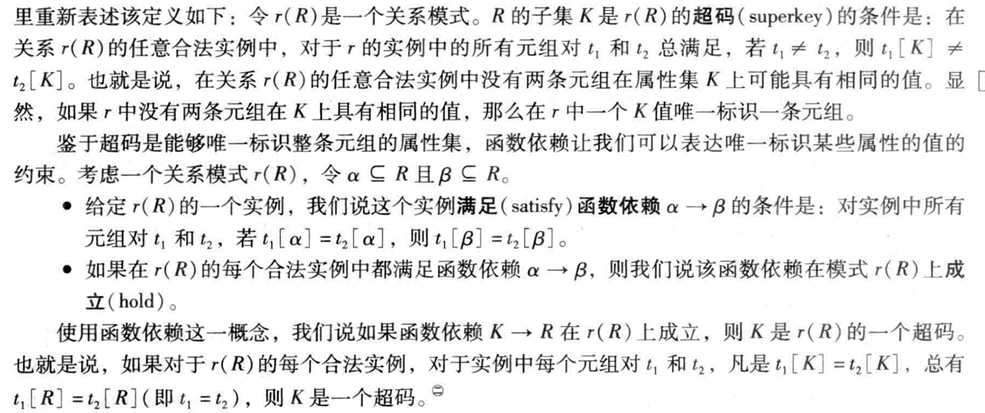
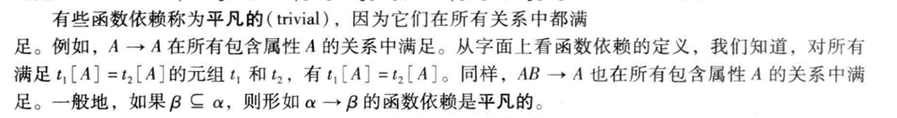

## 好的关系设计的特点

### 设计选择：更大的模式

### 设计选择：更小的模式

#### 函数依赖

* ***函数依赖：***在一个表里面，属性X可以映射到属性Y，也就是说知道了X就能确定Y，称X为决定因素。
  举栗子🌰：有一个关系模式S(Sno,Sname,Sage)
  如果知道了一个学生的学号Sno，那我就能确定他的姓名Sname和年龄Sage。

  当然，如果你强制规定学生姓名不能重复。那么，知道了一个学生的姓名也是可以确定其他属性的，这也是满足函数依赖关系的。

  

  

​			***注：***平凡函数依赖和非平凡函数依赖在这里不做解释

* ***完全函数依赖和部分函数依赖***
  直接举栗子🌰：有一个关系模式S(Sno,Sname,Cno,Grade)

  * **完全函数依赖：**如果我想知道某位学生的某一门课的成绩Grade，那我必须得同时知道他的学号Sno和课程号Cno。
    但如果我只知道一部分信息，比如他的Sno或者Cno可以吗？答案是不行的！此时称Y[Grade]完全依赖于X[Sno,Cno]。

  

  * **部分函数依赖：**如果我想知道某位学生的姓名Sname，那我知道他的学号Sno就可以了。也就是说Y[Sname]只函数依赖于X[Sno,Cno]中的子集x[Sno]，此时称Y部分函数依赖于X。

    

* ***传递函数依赖***
  直接讲人话🌰：有一个关系模式S(Sno,Sdept,Mname)
  如果我知道了一个学生的学号Sno，那我就能知道他所在的系Sdept。(因为理论上一个学生只属于一个系)
  如果我知道了某一个系Sdept，那么我就能知道这个系的系主任的姓名Mname。
  也就是说，我知道了一个学生的学号Sno，其实我就知道了他所在系的系主任的姓名Mname。但这个过程中，他们是不存在直接函数依赖的，我需要通过系名称Sdept作为一个桥梁去把二者联系起来的。

#### 无损分解

***概念***：无损分解指的是对关系模式分解时，原关系模型下任一合法的关系值在分解之后应能通过自然联接运算恢复起来。反之，则称为有损分解。

设R是一个关系模式，F是R上的一个依赖集，R分解为关系模式的集合p={R1(U1),R2(U2),....,Rn(Un)}。如果对于R中满足F的每一个关系r，都有r=πR1(r)⋈πR2(r)⋈..πRn(r)则称分解相对于F是无损连接分解，否则有有损连接。

***怎么测试是否为无损连接***

* 构造一个k行n列的表格，每列对应一个属性Aj（j=1,2,..n),每行对应一个模式Ri(Ui)=(i=1,2...k)的属性集合。如果Aj在Ui中，那么表格的第i行j列处添上记号aj，否则添上记号bij.
* 复查F的每一个函数依赖，并且修改表格中的元素，直到表格不能修改为止。
  取F中函数依赖X->Y,如果表格中总有两行在X分量上相等，在Y分量上不相等，则修改Y分量的值，使这两行在Y分量上相等，有以下两种情况：
  * 如果Y分量中有一个是aj，则另一个也变成aj
  * 如果Y分量中没有aj，就用下标较小的bij替换另一个符号。

* 修改结束后一行全是a，则p相对于F是无损分解。

## 原子域和第一范式

在关系模型中，我们将属性不具有任何子结构这个思想形式化。一个域是**原子的**，如果该域的元素被认为是不可分的单元。我们称一个关系模式R属于**第一范式**，如果R的所有属性的域都是原子的。

* 名字的集合是一个非原子值的例子。例如，如果关系employee的模式包含一个属性children，它的域元素是名字的集合，该模式就不属于第一范式。
* 组合属性，包含子属性也具有非原子域。
* 假定整数是原子的，那么整数的集合是一个原子域；然而所有整数集的集合是一个非原子域。

## 使用函数依赖进行分解

* 一般情况下，我们用**α**表示属性集，r(R)指关系模式。我们用表示法r(R)表示该模式是关系r的，R表示属性集。
* 一个关系模式是一个属性集，但并非所有的属性集都是模式。
* 当属性集是一个超码时，我们用K表示它。超码属于特殊的关系模式，使用术语“K是r(R)的超码”
* 一个关系在任意给定时间都有特定的值，我们将那看作一个实例并使用术语“**r**的实例“。

### 码和函数依赖

* 一个数据库对现实世界中的一组实体和联系建模。在现实世界中，数据上通常存在各种约束（规则）。
* 一个关系的满足所有这种现实世界约束的实例，称为关系的**合法实例**；在一个数据库的合法实例中所有的关系实例都是合法实例。
* **超码**可以唯一标识关系中一条元组的一个或多个属性的集合。在此重新表述：

* 我们以两种方式使用函数依赖：
  * 判断关系的实例是否满足给定函数依赖集F。
  * 说明合法关系集上的约束。因此，我们将只关心给定函数依赖集的那些关系实例。如果我们希望值考虑模式R上满足函数依赖集F的关系，我们说F在r(R)上**成立**。
* 
* 我们使用**F^+^**表示F集合的闭包。

### Boyce-Code范式

* 具有函数依赖集F的关系模式R属于BCNF（Boyce-Code Normal Form,BCNF,Boyce-Code范式）的条件是，对**F^+^**中所有形如α -> β的函数依赖（其中α ⊆ R,且β⊆R），下面至少有一项成立：
  * α -> β 是平凡的函数依赖即β⊆α
  * α是模式R的一个超码
  * 一个数据库设计属于CBCNF的条件是构成该设计的关系模式集中的每个模式都属于BCNF。

### BCNF和保持依赖

