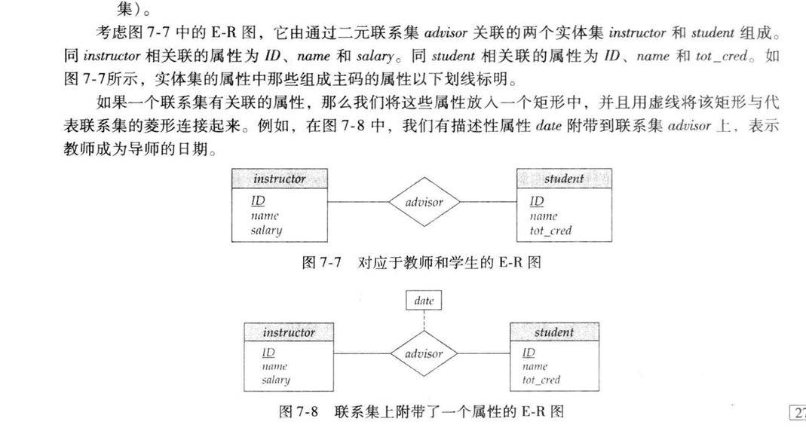
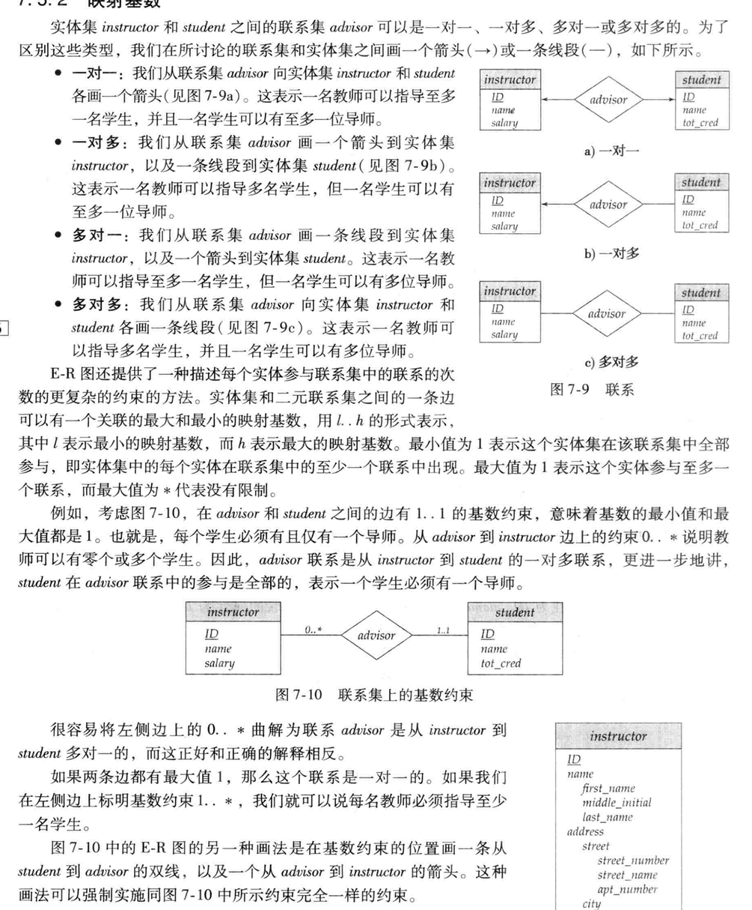
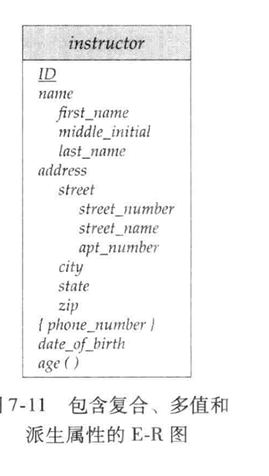
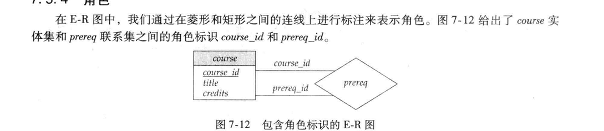
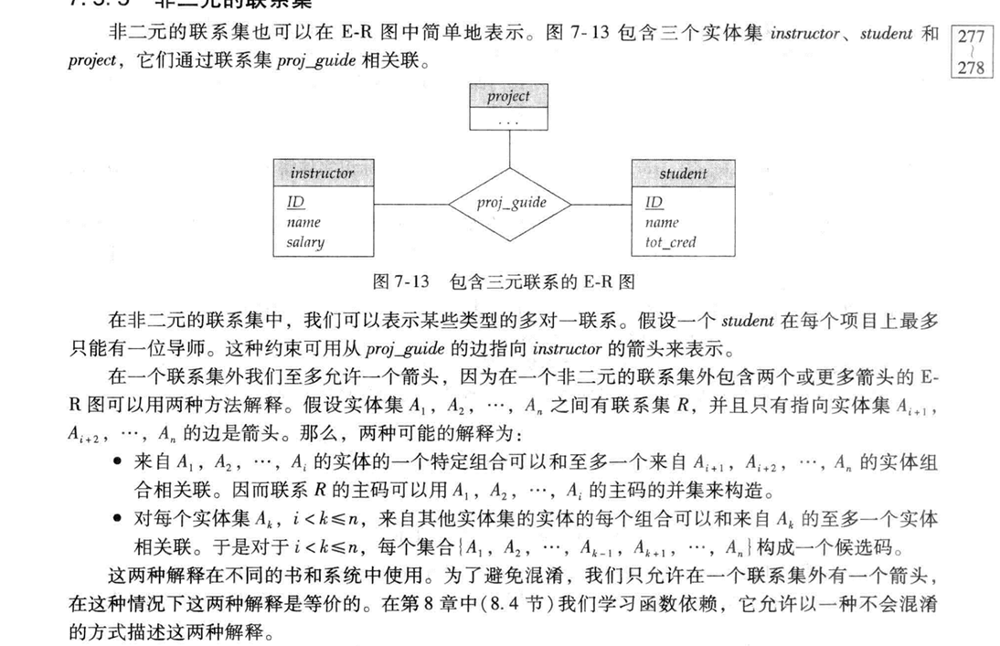

## 设计过程概览

构建一个数据库应用是一个复杂的任务，包括设计数据库模式，设计访问和更新数据的程序，以及设计控制数据访问的安全模式。

### 设计阶段

* 数据库设计的最初阶段需要完整地刻画未来数据库用户的数据需求。
* 设计者选择数据模型，并采用所选数据模型的概念将这些需求转化为数据库的***概念模式***。
* 完善的概念模式还指明企业的功能需求。在***功能需求规格说明***中，用户描述将在数据上进行各类操作。
* 从抽象数据模型到数据库实现的转换过程在最后两个设计阶段中进行。
  * 逻辑设计阶段
  * 物理设计阶段

### 设计选择

* 避免两个主要缺陷：
  * *** 冗余***
  * ***不完整***

## 实体 - 联系模型

实体-联系（entity - relationship,E-R）数据模型的提出旨在方便数据库的设计，通过允许定义代表数据库全局逻辑结构的企业模式实现的。

***E-R数据模型三个基本概念：***实体集，联系集，属性。

### 实体集

* ***实体：***现实世界中可区别于所有其他对象的一个“事务”或“对象”。每个实体有一组性质，其中一些性质的值可以唯一地标识一个物体。
* ***实体集合：***相同类型即具有相同性质的一个实体集合。
  * 
  * 实体集不必互不相交。
  * 实体通过一组***属性***来表示，属性是实体集合中每个成员所拥有的描述性性质。为某实体集指定一个属性表明数据库为该实体集中每个实体存储相似的信息；但每个实体在每个属性上都有各自的值。
  * 每个实体的每个属性都有一个***值***。

### 联系集

* ***联系：***指多个实体间的相互关联。
* ***联系集：***相同类型联系的集合。
* ***参与：***实体集之间的关联。

### 属性

每个属性都有一个可取值的集合，称为该属性的***域***或者***值集***。

E-R模型中的属性可以按照如下的属性类型进行划分：

* ***简单***和***复合***属性。
* ***单值***和***多值***属性。
* ***派生***属性。

## 约束

### 映射基数

* ***映射基数：***表示一个实体通过一个联系集能关联的实体个数。

对于实体集A和B之间的二元联系集R来说映射基数必然是一下情况之一：

* ***一对一***
* ***一对多***
* ***多对一***
* ***多对多***

### 参与约束

如果实体集E中的每个实体都参与到联系集R的至少一个联系中，实体集E在联系集R中的参与称为***全部***的。

如果E中只有部分实体参与到R的联系中，实体集E到联系集R的参与称为***部分***的。

### 码

* 从概念上来说，各个实体是***互异***的；但从数据库的观点来看，它们的区别必须通过其***属性***来表明。
* 一个实体的属性的值必须可以***唯一标识***该实体，在一个实体集中不允许两个实体对于所有属性都具有完全相同的值。
* 码的概念***直接适用***实体集。

## 从实体集中删除冗余属性

当我们使用E-R模型设计数据库时，完美通常从确定那些应当包含的实体集开始。一旦选择好实体和它们相应的属性，不同实体间的联系集就建立起来了。这些联系集有可能会导致不同实体集中的属性冗余，并需要将其从原始实体集中删除。

## 实体-联系图

E-R图可以图形化表示数据库的全局逻辑结构。

### 基本结构

E-R图包括如下几个主要构件：

* ***分成两部分的矩形：***代表实体集，第一部分包含实体集的名字，第二部分包含实体集中所有属性的名字。
* ***菱形：***代表联系集。
* ***未分割的矩形：***代表联系集的属性。构成主码的属性以下划线标明。
* ***线段：***将实体集连接到联系集。
* ***虚线：***将联系集属性连接到联系集。
* ***双线：***显示实体在联系集中的参与度。
* ***双菱形：***代表连接到弱实体集的标志性联系集。

### 映射基数

### 复杂的属性

下图说明了如何表示复杂属性

### 角色

### 非二元的联系集

### 弱实体集

* 没有足够的属性以形成主码的实体集称作***弱实体集***。有主码的实体集称作***强实体集***。
* 弱实体集必须与另一个称作***标识***或***属主实体集***的实体集关联才能有意义。每个弱实体必须和一个标识实体相关联；弱实体集***存在依赖于标志实体集***。我们称标识实体集***拥有***它所标识的弱实体集。将弱实体集与其标识实体集相联的联系称为***标识性联系***。
* 标识性联系是从弱实体集到标识实体集多对一的，并且弱实体集在联系中的参与是全部的。标识性联系集不应该有任何描述性属性，因为这种属性中的任意一个都可以与弱实体集相关联。
* 弱实体集的***分辨符***是使得我们进行这种区分的属性集合。

## 转换为关系模式

我们可以将一个符合E-R数据库模式的数据库表示为一些关系模式的集合。

### 具有简单属性的强实体集的表示

### 具有复杂属性的强实体集的表示

### 弱实体集的表示

### 联系集的表示

#### 模式的合并

## 实体-联系设计问题

### 用实体集还是用属性

### 用实体集还是用联系集

### 二元还是n元联系集

### 联系属性的布局

## 扩展的E-R特性

### 特化

### 概化

### 属性继承

### 概化上的约束

### 聚集

### 转换为关系模式

## 数据建模的其他表示方法

### E-R图的其他表示法

### 统一建模语言UML

## 数据库设计的其他方面

### 数据约束和关系数据库设计

### 使用需求：查询、性能

### 数据库设计的其他问题

